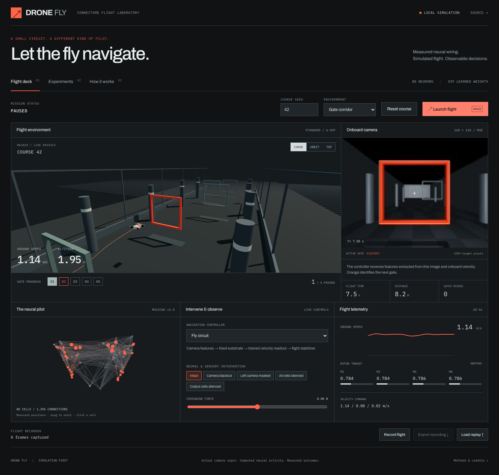

# Drone Fly

**A measured fruit-fly circuit navigating a simulated quadcopter.**

Fly through a 3D gate course, watch the real onboard camera and computed neural activity, then mask the camera, silence cells, or apply crosswind. Train the navigation readout and compare measured wiring with rewired and conventional feature networks on unfamiliar courses.

This release is a local, simulation-first flight laboratory. MuJoCo advances a generic quadcopter through four rotor thrust actuators. It does not connect to or fly a physical drone.



## Start

Requires **uv**, **Python 3.12** (uv can install it), **Node.js 22.18+** (24 recommended), and a browser with WebGL. The pretrained readouts and small anatomical graph are included; no dataset account, cloud service, or GPU training is required.

```sh
git clone https://github.com/mohamedsobhi777/drone-fly.git
cd drone-fly
./scripts/start.sh
```

Open **http://127.0.0.1:8765**. This private repository requires GitHub access when cloning.

The launcher synchronizes Python dependencies, installs the frontend dependencies, builds the workbench, and starts the local server. Alternatively:

```sh
uv sync --frozen --extra dev
npm --prefix web ci
npm --prefix web run build
uv run drone-fly
```

On Linux without a display, set `MUJOCO_GL=egl` and install Mesa/EGL (for example `libegl1 libgl1 libgl1-mesa-dri` on Ubuntu). A renderer is necessary because the policy consumes actual RGB images. On macOS the ordinary Python launcher works for this offscreen renderer; no native MuJoCo viewer is opened.

## Try the experiment

1. Keep **Fly circuit**, seed **42**, and **Gate corridor**. Click **Launch flight**. The episode starts airborne at a stable 1.7 m pose and navigates five gates.
2. Switch the world view between **Chase**, **Orbit**, and **Top**. Drag the circuit to inspect measured cell-body positions; click a cell for its ID, type, and computed activity.
3. Try **Left camera masked** or **Output cells silenced** during flight. Reset to repeat the same course. Camera masks are visible in the actual image used by the policy.
4. Try **Wide slalom** or **Crosswind**, then **Reset course** to apply the chosen environment and seed. The wind slider adds a lateral force; the Crosswind environment also supplies an oscillating force.
5. Select **Record flight** before launching, stop the recording, and export the JSON. **Load replay** restores the recorded camera, trajectory, telemetry, circuit states, and interventions. Replay is local and does not rerun inference.
6. Open **Experiments** for the shipped benchmark, fresh training, cancellable held-out evaluations, and downloadable results. **How it works** explains all modeling assumptions and credits.

Space toggles flight/pause when focus is outside an input or button. Pausing freezes physics and recurrent activity. Each browser connection owns a separate flight; experiment jobs and locally trained checkpoints are shared by the server.

## What actually runs

```text
MuJoCo RGB camera + inertial velocity
                 ↓
8 engineered fiducial/velocity features
                 ↓
80-cell fixed MaleCNS circuit, 3 recurrence steps per decision
                 ↓
16 output cells → fixed nonlinear expansion → 339 trained coefficients
                 ↓
3 velocity commands → conventional attitude/velocity servo
                 ↓
4 rotor thrusts → 240 Hz rigid-body physics
```

The camera is gimbal-stabilized and looks along the course. A color threshold finds the orange active gate. This is an engineered fiducial-navigation task, not learned semantic vision. Navigation updates at 20 Hz. The neural activity is dimensionless simulated state, not measured spikes. The learned readout never receives the eight observation features directly.

Training uses **ridge-regression imitation of an explicit visual-servo teacher**, not reinforcement learning or biological synaptic plasticity. All three learned substrates receive the same observations, target commands, and training budget. The fourth controller is the teacher itself.

## Recorded results

Shipped checkpoint: **12,045 observations from 24 training courses**, seeds 100–123. Held-out evaluation: **12 paired courses**, seeds 1000–1011, cycling through corridor, slalom, and crosswind. Every condition uses the same course set.

| Controller / intervention | Completed | Mean gates / 5 | Collisions |
| --- | ---: | ---: | ---: |
| Measured fly circuit | 12/12 | 5.00 | 0 |
| Degree-preserving rewired circuit | 12/12 | 5.00 | 0 |
| Conventional random features | 12/12 | 5.00 | 0 |
| Handwritten visual servo | 12/12 | 5.00 | 0 |
| Fly circuit, camera blackout | 2/12 | 2.17 | 7 |
| Fly circuit, left camera masked | 0/12 | 0.00 | 12 |
| Fly circuit, all cells silenced | 0/12 | 0.00 | 12 |
| Fly circuit, output cells silenced | 0/12 | 0.00 | 12 |

This demonstrates successful simulated navigation and dependence on the intended camera/circuit path. **It does not demonstrate an advantage from biological topology.** The task has a ceiling effect, the visual-servo baseline is also the teacher, and each substrate has only one fitted checkpoint. A 12/12 completion rate has a Wilson 95% interval of approximately 76–100%.

Exact checkpoint fingerprints, per-course outcomes, confidence intervals and timing: [models](artifacts/models.json), [benchmark](artifacts/benchmark.json), [methods](docs/METHODS.md). The initial local runs took approximately 51 s for training and 100 s for the complete 96-episode comparison; these are observations on the development machine, not performance guarantees.

## Reproduce and extend

Keep the shipped artifacts intact by writing to a separate directory:

```sh
uv run python -m drone_fly.experiments train --courses 24 --output .local/reproduction
uv run python -m drone_fly.experiments benchmark --courses 12 \
  --models .local/reproduction/models.json --output .local/reproduction
```

The default output is `artifacts/`; omit `--output` only when intentionally replacing those files. CLI-generated checkpoints are not automatically activated in the browser. Workbench training writes to `.local/experiments/`, activates a validated completed checkpoint, and leaves shipped artifacts unchanged. Reset a flight to load the new readouts. Cancellation retains the previous checkpoint. The benchmark page warns when results belong to a different checkpoint. To return the workbench to the shipped models, stop the server and remove only `.local/active-models.json`.

For frontend development, keep the backend running and run `npm --prefix web run dev` in another terminal; Vite proxies API and WebSocket traffic to port 8765.

| File | Responsibility |
| --- | --- |
| `drone_fly/physics.py` | Quadrotor model, servo, camera, contacts, scoring |
| `drone_fly/course.py` | Seeded gates and obstacle geometry |
| `drone_fly/vision.py` | Actual-pixel observation encoder and imitation teacher |
| `drone_fly/circuit.py` | Measured graph, rewiring, dynamics, readout |
| `drone_fly/experiments.py` | Shared-data training, held-out runs, artifact fingerprints |
| `drone_fly/server.py` | Session lifecycle, WebSocket protocol, background jobs |
| `web/src/` | Flight deck, camera, neuron inspection, replay and experiments |

## Verification

```sh
uv run ruff check drone_fly scripts tests
uv run ruff format --check drone_fly scripts tests
uv run pytest -q
npm --prefix web run build
cd web
npx playwright install chromium
npm run test:e2e
```

Python tests exercise force-based flight, contacts, camera causality, graph provenance/rewiring, actual trained inference, held-out flight, background training and cancellation, and API validation. Browser tests cover launch/pause, masking, recording export/import, replay, experiment cancellation, and mobile layout. GitHub Actions runs the same workflow with software rendering on Linux.

## Credits and license

Original Drone Fly code: [MIT](LICENSE). Measured MaleCNS data: **CC BY 4.0**, credited to FlyEM / HHMI Janelia, University of Cambridge, MRC Laboratory of Molecular Biology and Google Research.

The measured circuit extract comes from [Fly Dino](https://github.com/cobanov/flyjump) by [Mert Cobanov](https://github.com/cobanov), pinned to revision `c08c86bc18efd8125964b1d2ca4fc1df59700f30`. We use the independently licensed graph data and credit its selection; the application and flight model are new implementations. [Third-party notices](THIRD_PARTY_NOTICES.md).
